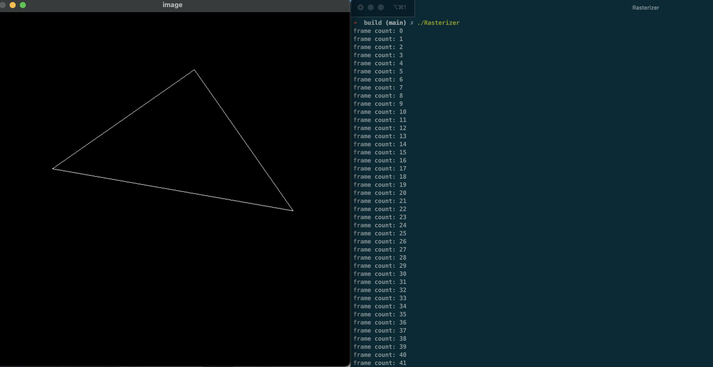
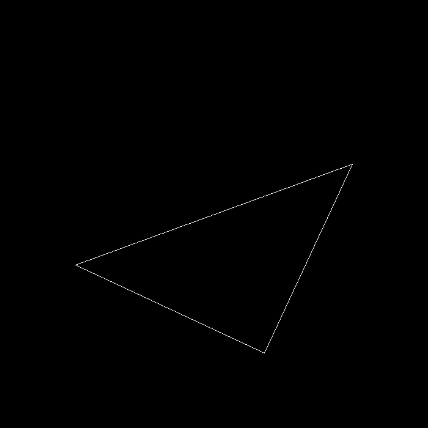
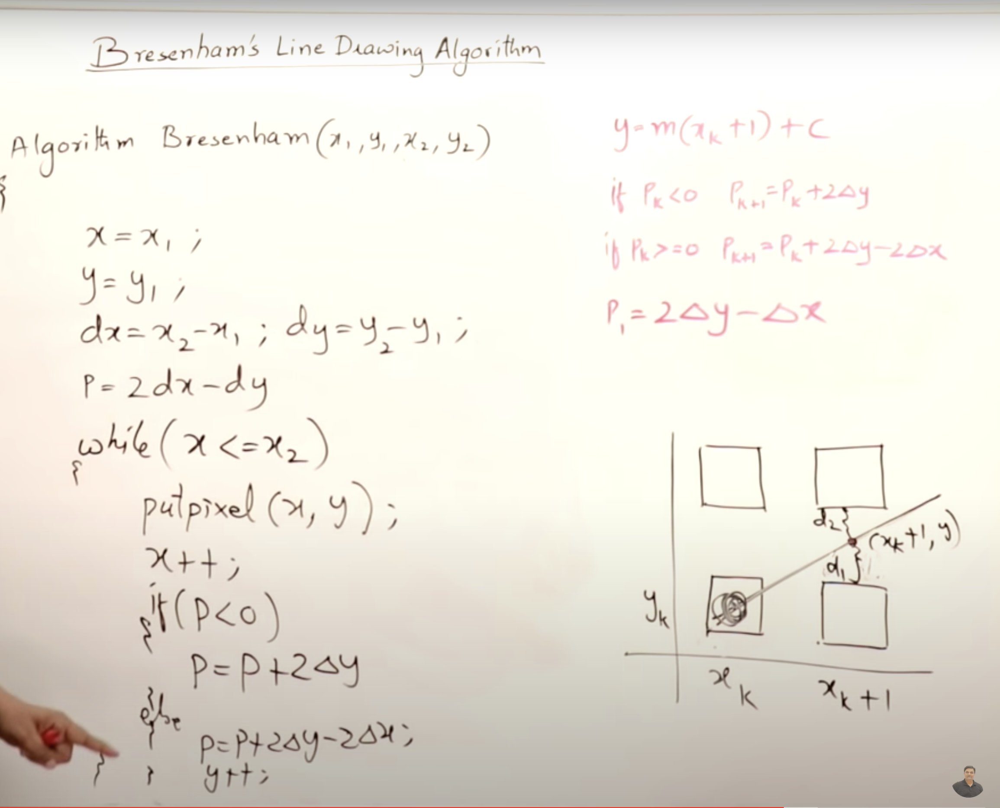

# Assignment1

## Compile and Run it

**Compile**<br>
```unix
mkdir Raseterizer/build; cd Rasterizer/build
cmake ..
make
```
**Run**<br>
```unix
./Rasterizer
```

**(You can press 'A' and 'D' to control this transformation)**
```unix
./Rasterizer -r 20 r20.png
```


## Techniques

### The Bresenham's Line Drawing Algorithms
**This fig is taken from youtube [Mr.Abdul Bari](https://www.youtube.com/watch?v=RGB-wlatStc)**


**Achieve in C++**
```cpp
void rst::rasterizer::draw_line(Eigen::Vector3f begin, Eigen::Vector3f end)
{
    auto x1 = begin.x();
    auto y1 = begin.y();
    auto x2 = end.x();
    auto y2 = end.y();

    Eigen::Vector3f line_color = {255, 255, 255};

    int x,y,dx,dy,dx1,dy1,px,py,xe,ye,i;

    dx=x2-x1;
    dy=y2-y1;
    dx1=fabs(dx);
    dy1=fabs(dy);

    // if -1 =< dy/dx <= 1
    // p1 = 2dy - dx (initial value for p)
    px=2*dy1-dx1;

    // if dy/dx > 1
    py=2*dx1-dy1;

    if(dy1<=dx1)
    // k <= 1
    {
        // begining point
        if(dx>=0)
        {
            x=x1;
            y=y1;
            xe=x2; // end x
        }
        else
        // same as x
        {
            x=x2;
            y=y2;
            xe=x1;
        }
        Eigen::Vector3f point = Eigen::Vector3f(x, y, 1.0f);
        set_pixel(point,line_color);
        for(i=0;x<xe;i++)
        {
            x=x+1;
            if(px<0) // y = y
            {
                px=px+2*dy1; // p = px + 2dy
            }
            else
            {
                if((dx<0 && dy<0) || (dx>0 && dy>0)) // k > 0
                {
                    y=y+1;
                }
                else
                {
                    y=y-1;
                }
                px=px+2*(dy1-dx1); // p = p + 2dy - 2dx
            }
//            delay(0);
            Eigen::Vector3f point = Eigen::Vector3f(x, y, 1.0f);
            set_pixel(point,line_color);
        }
    }
    else // just reverse x and y (when k(dy/dx) is greater than 1 or smaller than -1
    {
        if(dy>=0)
        {
            x=x1;
            y=y1;
            ye=y2;
        }
        else
        {
            x=x2;
            y=y2;
            ye=y1;
        }
        Eigen::Vector3f point = Eigen::Vector3f(x, y, 1.0f);
        set_pixel(point,line_color);
        for(i=0;y<ye;i++)
        {
            y=y+1;
            if(py<=0)
            {
                py=py+2*dx1;
            }
            else
            {
                if((dx<0 && dy<0) || (dx>0 && dy>0))
                {
                    x=x+1;
                }
                else
                {
                    x=x-1;
                }
                py=py+2*(dx1-dy1);
            }
//            delay(0);
            Eigen::Vector3f point = Eigen::Vector3f(x, y, 1.0f);
            set_pixel(point,line_color);
        }
    }
}

```
