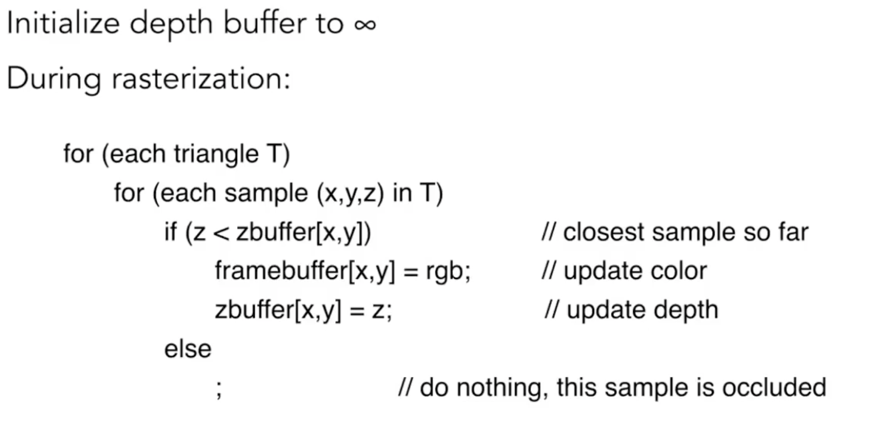
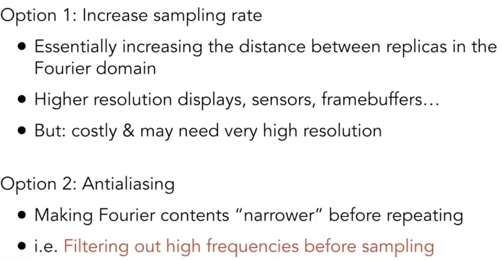
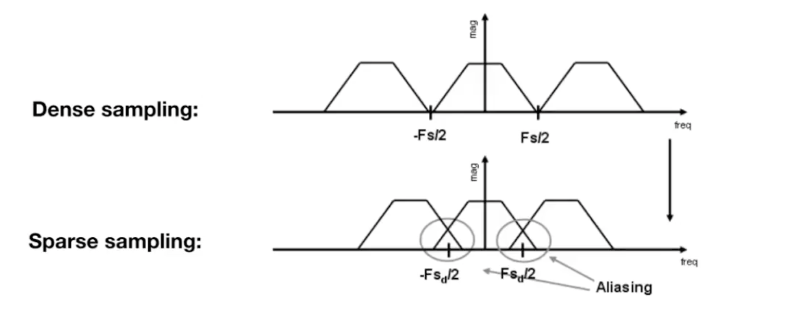
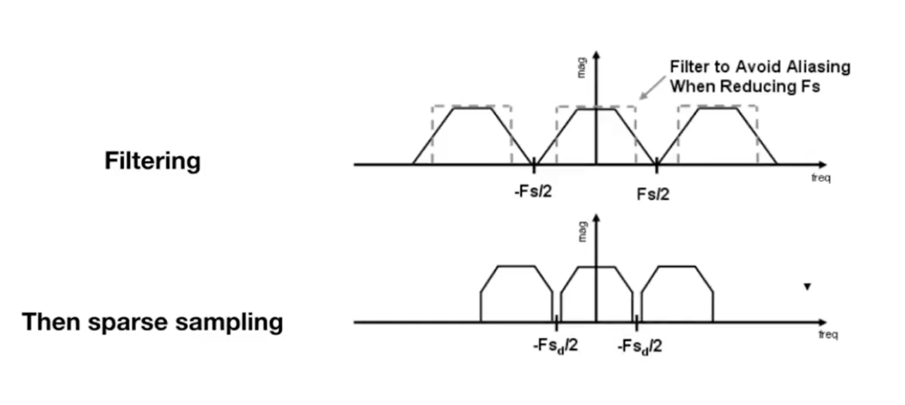
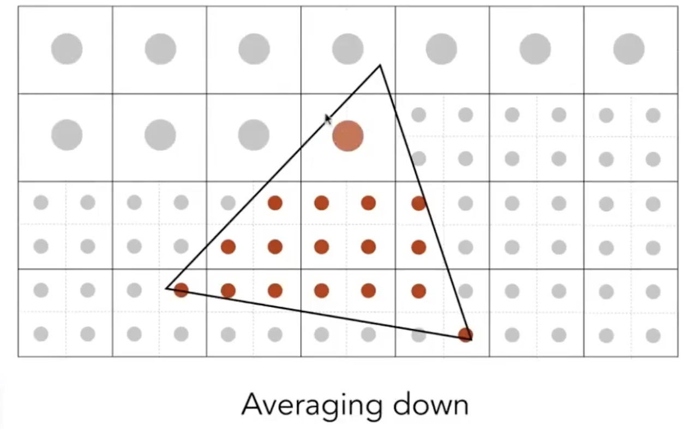
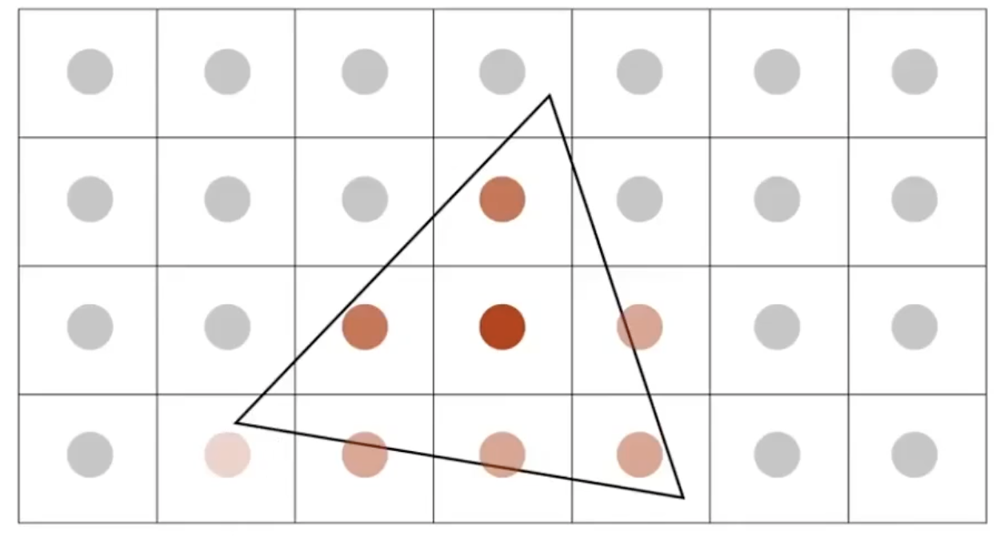
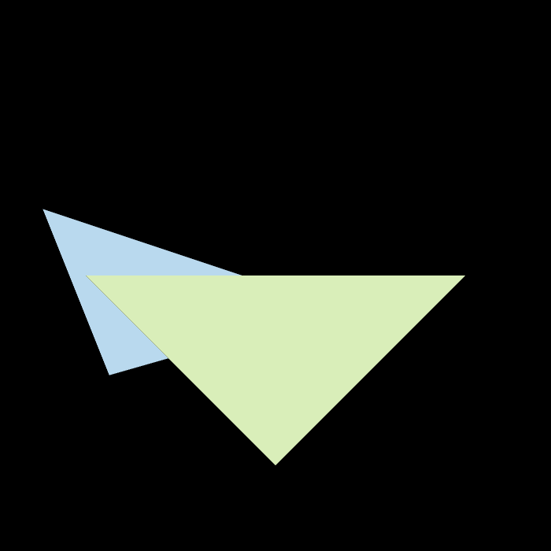
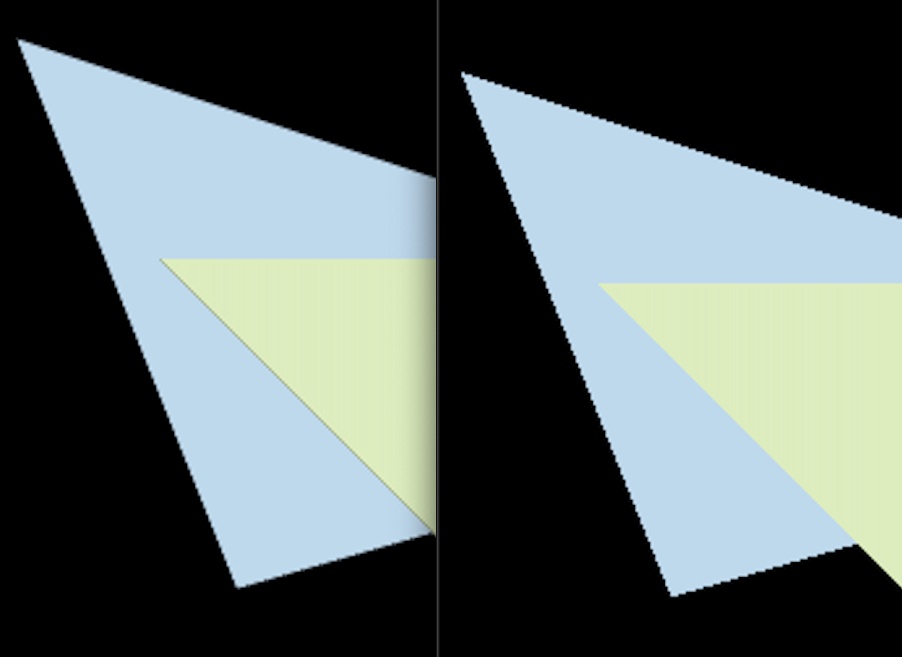

# Assignment2

## Compile and Run it
**Compile**<br>
```unix
mkdir Raseterizer/build; cd Rasterizer/build
cmake ..
make
```
**Run**<br>
```unix
./Rasterizer output.png
```


## Techniques

### Z-buffer algorithms

**Achieve in C++**

```cpp
// rasterizer.cpp
// z-buffer algorithm
if (depth_buf[get_index(x, y)] > z_interpolated) {
    Vector3f color = t.getColor();
    Vector3f point(3);
    point << (float)x, (float)y, z_interpolated;
    depth_buf[get_index(x, y)] = z_interpolated; // updated depth
    set_pixel(point, color);
}

```

### Antialiasing By Supersampling (MSAA)
#### Two ways reducing aliasing:


#### The Second Way - How can we reduce:
**The reason of aliasing:**



**Filtering out high frequencies...**



#### Achieve (Keyword Avg)




**Achieve in C++**
```cpp
// rasterizer.cpp
if (MSAA) {
    // 2x2 supersampling
    std::vector<Eigen::Vector2f> pos
    {
        {0.25,0.25},
        {0.75,0.25},
        {0.25,0.75},
        {0.75,0.75},
    };
    for (int x = min_x; x <= max_x; x++) {
        for (int y = min_y; y <= max_y; y++) {
            // min depth (init with float max)
            float minDepth = FLT_MAX;
            // count the number of points which inside the triangle
            int count = 0;
            // for each points in 2x2 block
            for (int i = 0; i < 4; i++) {
                if (insideTriangle((float)x + pos[i][0], (float)y + pos[i][1], t.v)) {

                    // if inside the triangle;; caculate the z-interpolated value
                    auto tup = computeBarycentric2D((float)x + pos[i][0], (float)y + pos[i][1], t.v);
                    float alpha;
                    float beta;
                    float gamma;
                    std::tie(alpha, beta, gamma) = tup;
                    float w_reciprocal = 1.0 / (alpha / v[0].w() + beta / v[1].w() + gamma / v[2].w());
                    float z_interpolated = alpha * v[0].z() / v[0].w() + beta * v[1].z() / v[1].w() + gamma * v[2].z() / v[2].w();
                    z_interpolated *= w_reciprocal;

                    // update the minDepth
                    minDepth = std::min(minDepth, z_interpolated);
                    count++; // means that there is a more pointer inside the triangle
                }
            }
            if (count != 0) {
                if (depth_buf[get_index(x, y)] > minDepth) {
                    // get avg
                    Vector3f color = t.getColor() * count / 4.0;
                    Vector3f point(3);
                    point << (float)x, (float)y, minDepth;
                    depth_buf[get_index(x, y)] = minDepth;
                    set_pixel(point, color);
                }
            }
        }
    }

```
**Using MSAA:**
```unix
./Rasterizer output1.png
```


**Comparing (Left using MSAA)<br>**


