# Assignment3

## Compile and Run it
**Compile**<br>
```unix
mkdir Raseterizer/build; cd Rasterizer/build
cmake ..
make
```
**Run**<br>
* **Rasterizing using the normal shader**
```
./Rasterizer output.png normal
```


<br>

* **Rasterizing using the phong shader**
```
./Rasterizer phong.png phong
```


<br>

* **Rasterizing using the texture shader**
```
./Rasterizer texture.png texture
```


<br>

## Techniques
### Blinn-Phong Reflection Model
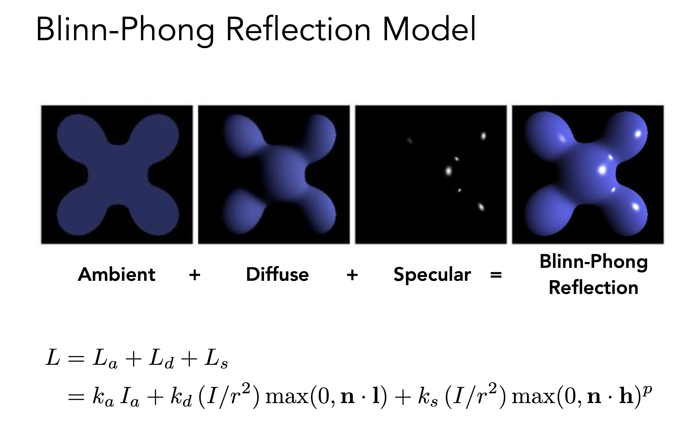

* **Ambient Light Intensity ```La```**

```cpp
// func phong_fragment_shader in main.cpp

Eigen::Vector3f ka = Eigen::Vector3f(0.005, 0.005, 0.005);
Eigen::Vector3f amb_light_intensity{10, 10, 10};
// ambient light intensity
Eigen::Vector3f La = ka.cwiseProduct(amb_light_intensity);
```

* **Diffuse Shading ```Ld```**

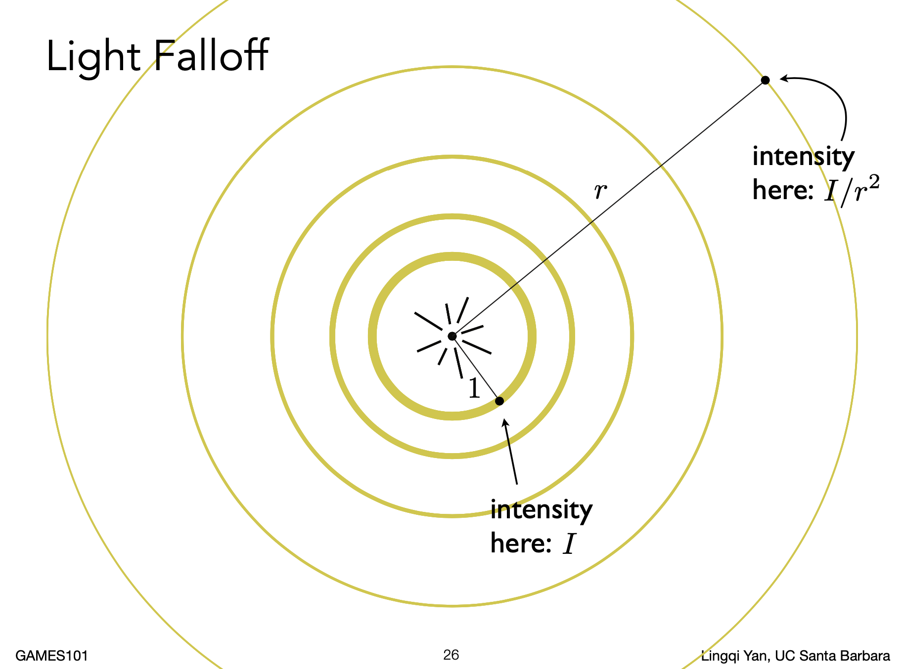

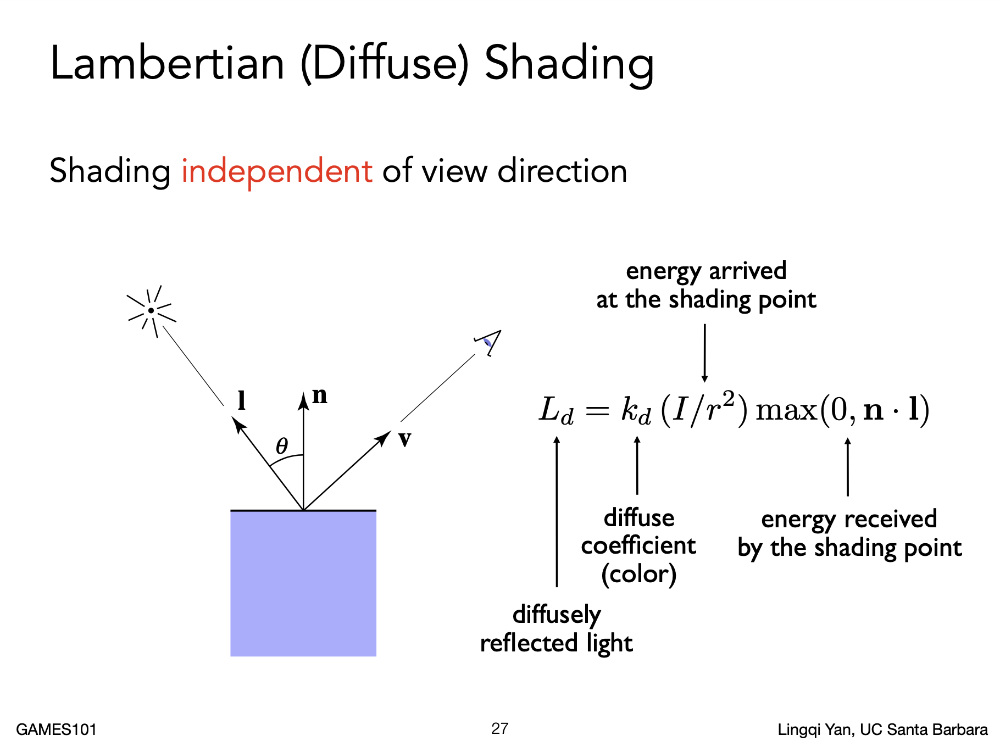

```cpp
// main.cpp 
struct light
{
    Eigen::Vector3f position;
    Eigen::Vector3f intensity;
};

// func phong_fragment_shader in main.cpp
// payload is a struct defined in Shader.hpp which define some attributes of a pixel in screen
Eigen::Vector3f kd = payload.color;

auto l1 = light{{20, 20, 20}, {500, 500, 500}}; // pos and intensity
auto l2 = light{{-20, 20, 0}, {500, 500, 500}};

std::vector<light> lights = {l1, l2};

for (auto& light : lights)
{
    // light direction
    Eigen::Vector3f light_dir = light.position - point;
    // r^2
    float r = light_dir.dot(light_dir);
    // diffuse
    Eigen::Vector3f Ld = kd.cwiseProduct(light.intensity / r);
    Ld *= std::max(0.0f, normal.normalized().dot(light_dir.normalized()));
}
```

* **Specular Shading ```Ls```**

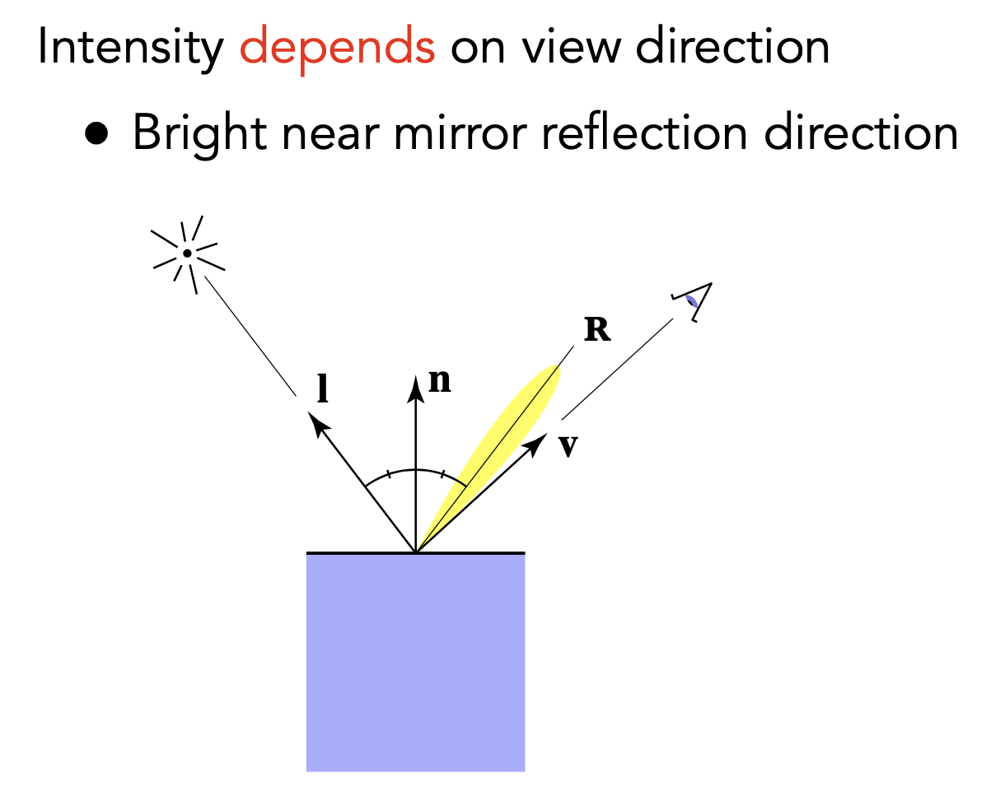

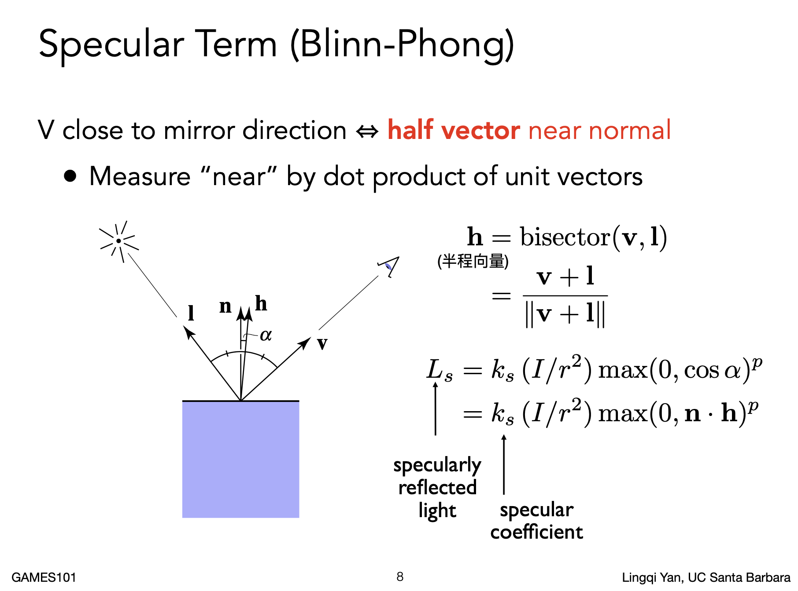

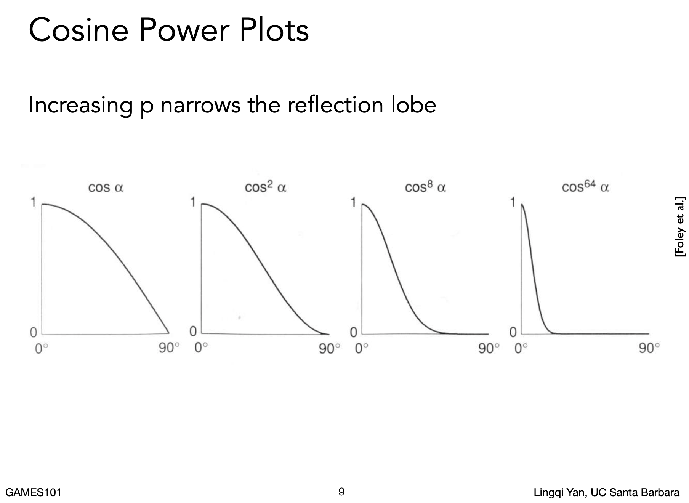

```cpp

for (auto& light : lights)
{
    // light direction
    Eigen::Vector3f light_dir = light.position - point;
    // view direction
    Eigen::Vector3f view_dir = eye_pos - point;
    // r^2
    float r = light_dir.dot(light_dir);
    // specular
    Eigen::Vector3f h = (light_dir + view_dir).normalized();
    Eigen::Vector3f Ls = ks.cwiseProduct(light.intensity / r);
    Ls *= std::pow(std::max(0.0f, normal.normalized().dot(h)), p);
}
```

<br>

### Texture Mapping

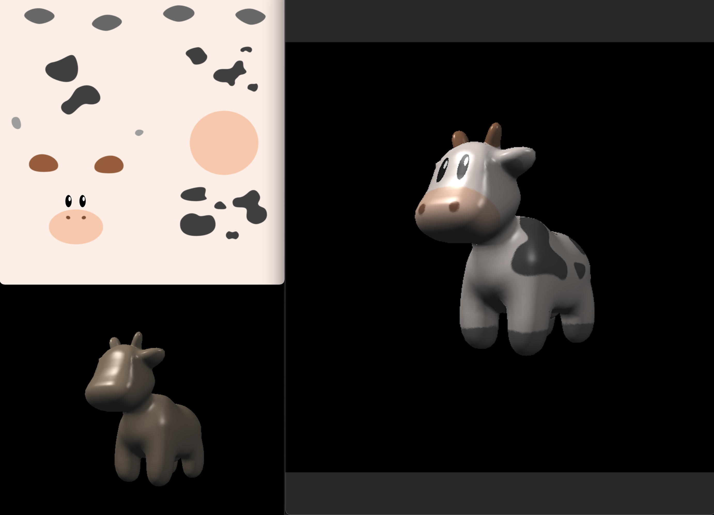
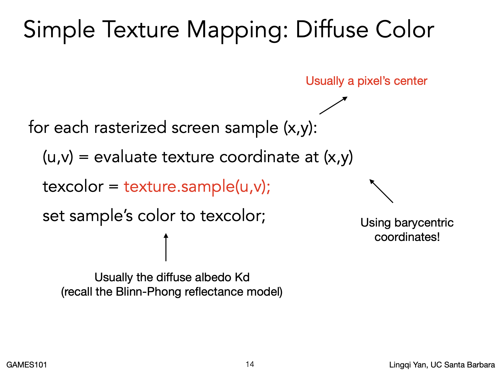

```cpp
// func texture_fragment_shader in main.cpp

Eigen::Vector3f return_color = {0, 0, 0};
if (payload.texture)
{
    return_color = payload.texture->getColor(payload.tex_coords.x(), payload.tex_coords.y());
}
Eigen::Vector3f texture_color;
texture_color << return_color.x(), return_color.y(), return_color.z();

Eigen::Vector3f kd = texture_color / 255.f;
// Then call the Blinn-Phong model
```

```cpp
// func getColor in Texture.hpp

Eigen::Vector3f getColor(float u, float v)
{
    auto u_img = u * width;
    auto v_img = (1 - v) * height;
    auto color = image_data.at<cv::Vec3b>(v_img, u_img);
    return Eigen::Vector3f(color[0], color[1], color[2]);
}

```

<br>

### Barycentric Coordinates (For Interpolation)
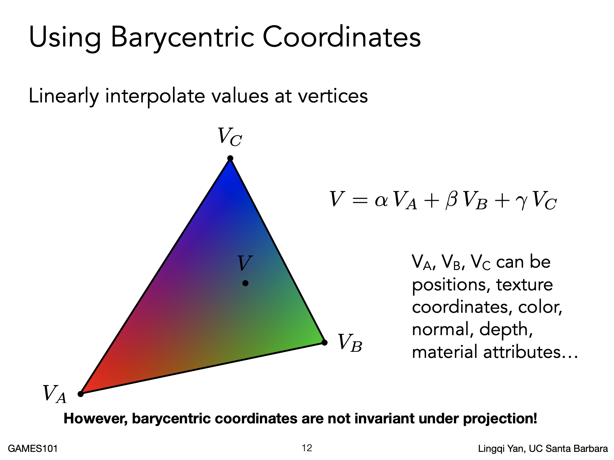
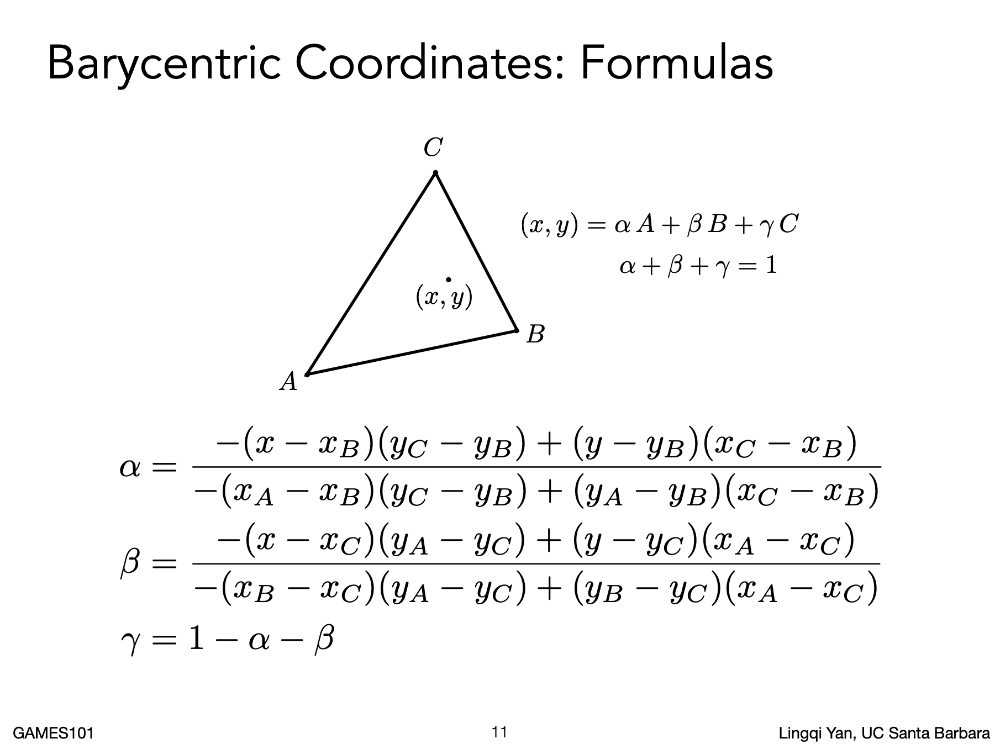

```cpp
// func computeBarycentric2D in rasterizer.cpp
static std::tuple<float, float, float> computeBarycentric2D(float x, float y, const Vector4f* v){
    float c1 = (x*(v[1].y() - v[2].y()) + (v[2].x() - v[1].x())*y + v[1].x()*v[2].y() - v[2].x()*v[1].y()) / (v[0].x()*(v[1].y() - v[2].y()) + (v[2].x() - v[1].x())*v[0].y() + v[1].x()*v[2].y() - v[2].x()*v[1].y());
    float c2 = (x*(v[2].y() - v[0].y()) + (v[0].x() - v[2].x())*y + v[2].x()*v[0].y() - v[0].x()*v[2].y()) / (v[1].x()*(v[2].y() - v[0].y()) + (v[0].x() - v[2].x())*v[1].y() + v[2].x()*v[0].y() - v[0].x()*v[2].y());
    float c3 = (x*(v[0].y() - v[1].y()) + (v[1].x() - v[0].x())*y + v[0].x()*v[1].y() - v[1].x()*v[0].y()) / (v[2].x()*(v[0].y() - v[1].y()) + (v[1].x() - v[0].x())*v[2].y() + v[0].x()*v[1].y() - v[1].x()*v[0].y());
    return {c1,c2,c3};
}
```

```cpp
// Example: Z-buffer interpolation
// depth interpolated
auto[alpha, beta, gamma] = computebarycentric2d(i + 0.5, j + 0.5, t.v);

float Z = 1.0 / (alpha / v[0].w() + beta / v[1].w() + gamma / v[2].w());
float zp = alpha * v[0].z() / v[0].w() + beta * v[1].z() / v[1].w() + gamma * v[2].z() / v[2].w();
zp *= Z;

```

<br>

### Bilinear Interpolation
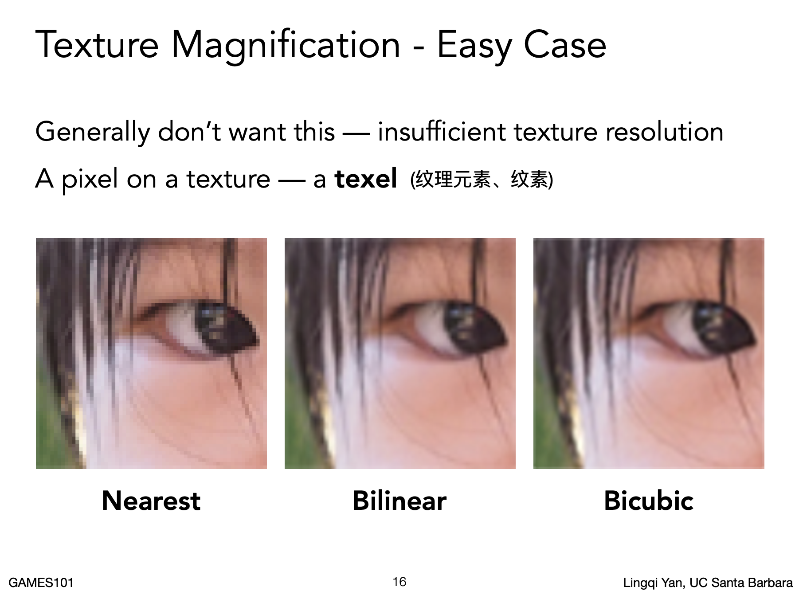

**In real situations, let's say we have a `4K` screen but only a `256x256` resolution texture**<br>
**Then there must have some pixel do not have their correspound texel<br>If we use the ```texture_shader``` above, we just can get the ```Nearest``` effects in the figure below**<br>

**Because in ```getColor``` function in Texture.hpp, for each pixel who do not have the correspound texel (or their coordinates were float), we just get round of them.**<br>
**To get the ```Bilinear``` effects. Let's discuss a interpolated way -- ```Bilinear Interpolation```**<br>

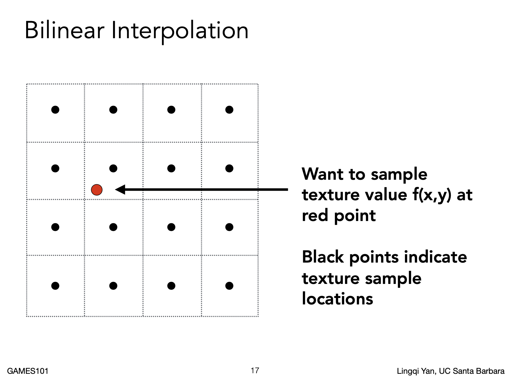
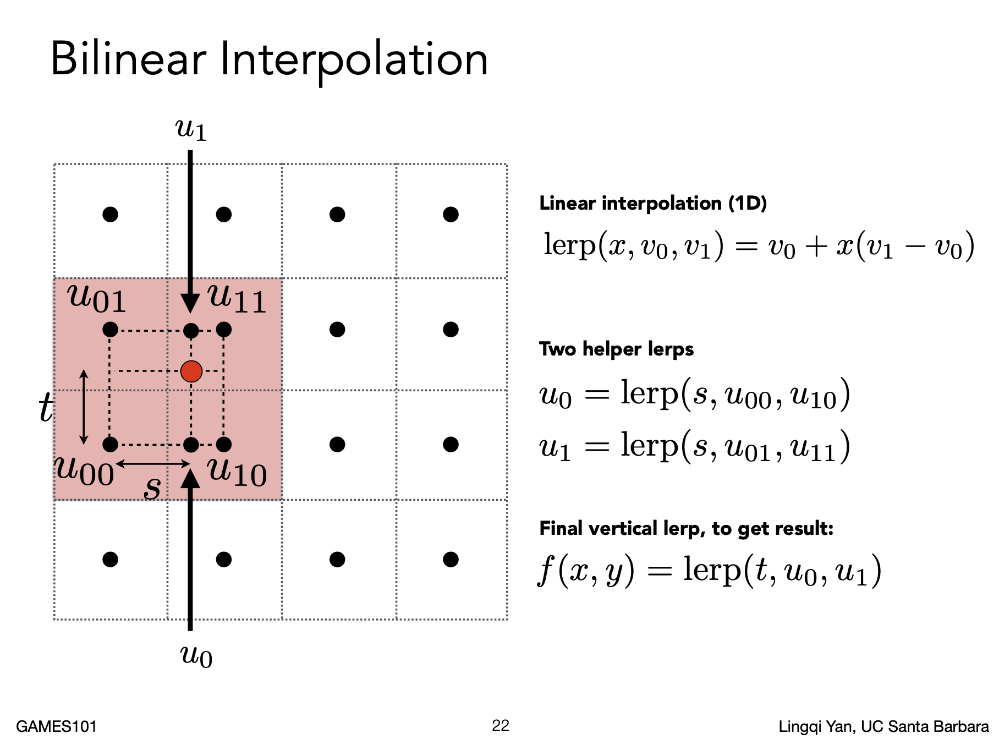

```cpp
Eigen::Vector3f getColorBilinear(float u, float v)
{
    if (u < 0) u = 0;
    if (u > 1) u = 1;
    if (v < 0) v = 0;
    if (v > 1) v = 1;
    auto u_img = u * width;
    auto v_img = (1 - v) * height;

    float u_min = std::floor(u_img);
    float u_max = std::min((float)width, std::ceil(u_img));
    float v_min = std::floor(v_img);
    float v_max = std::min((float)height, std::ceil(v_img));

    auto Q11 = image_data.at<cv::Vec3b>(v_max, u_min);
    auto Q12 = image_data.at<cv::Vec3b>(v_max, u_max);

    auto Q21 = image_data.at<cv::Vec3b>(v_min, u_min);
    auto Q22 = image_data.at<cv::Vec3b>(v_min, u_max);

    float rs = (u_img - u_min) / (u_max - u_min);
    float rt = (v_img - v_max) / (v_min - v_max);
    auto cBot = (1 - rs) * Q11 + rs * Q12;
    auto cTop = (1 - rs) * Q21 + rs * Q22;
    auto P = (1 - rt) * cBot + rt * cTop;

    return Eigen::Vector3f(P[0], P[1], P[2]);
}
```

**Here is the comparison between them: (right uses the ```Bilinear Interpolation```)**<br>

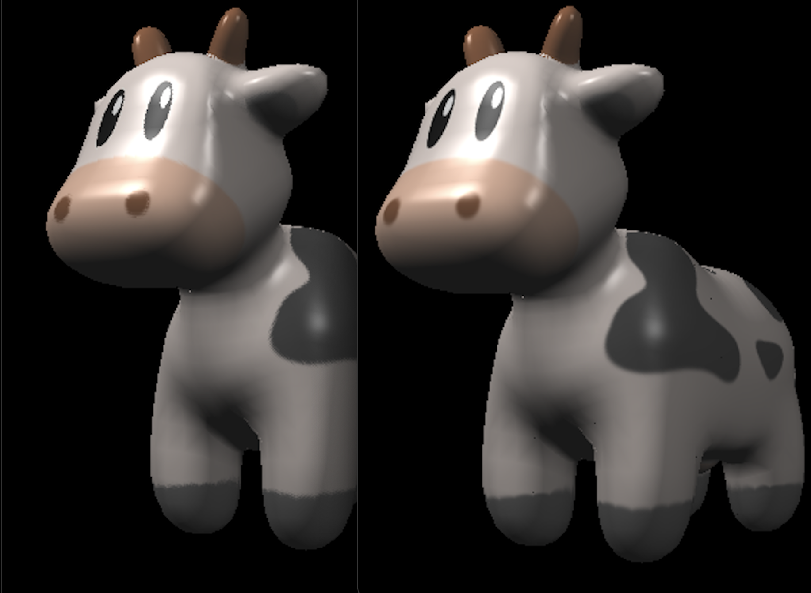


