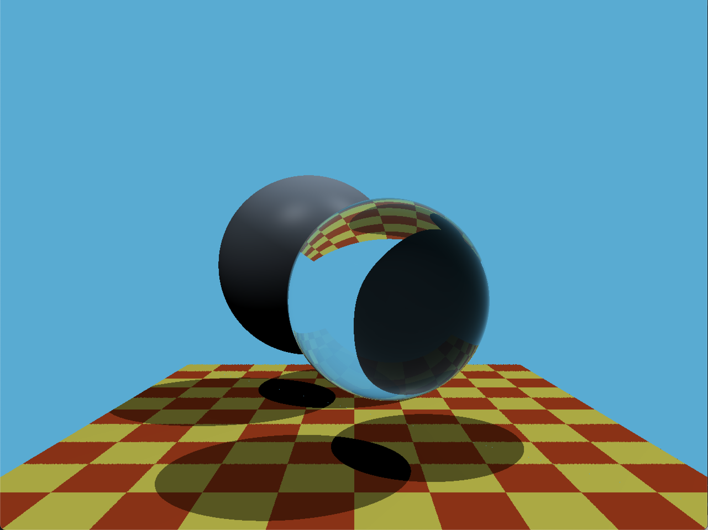
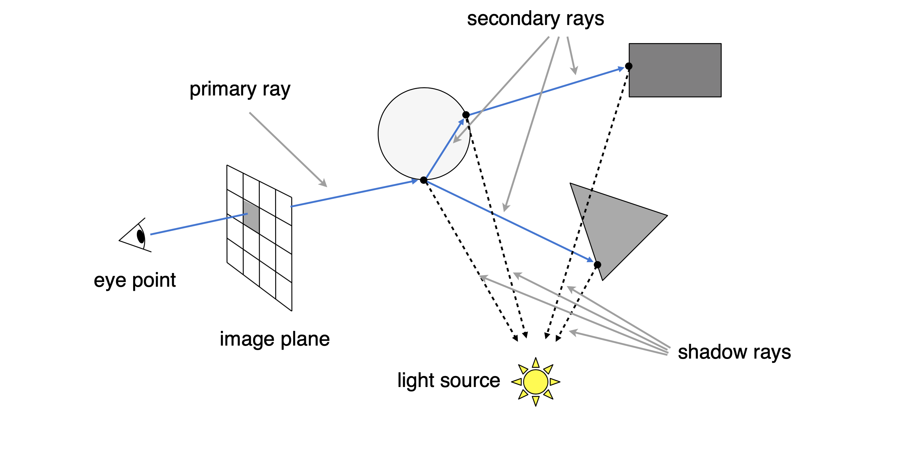
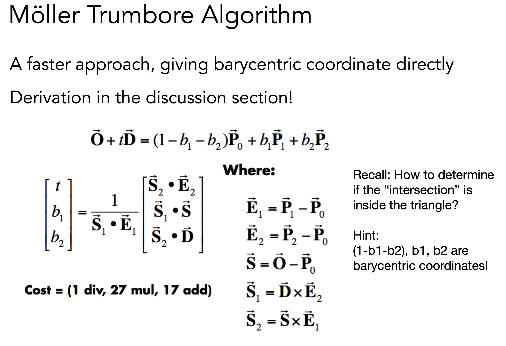

# Assignment5

## Compile and Run it
**Compile**<br>
```unix
mkdir Code/build; cd Code/build
cmake ..
make
```
**Run**<br>
```
./Raytracing
```


<br>

## Techniques
### Recursive Ray Tracing

#### 1. Find the primary ray
```cpp
// Render.cpp func Render(Scene&)
    std::vector<Vector3f> framebuffer(scene.width * scene.height);

    float scale = std::tan(deg2rad(scene.fov * 0.5f));
    // fov -> field of view
    float imageAspectRatio = scene.width / (float)scene.height;

    // Use this variable as the eye position to start your rays.
    Vector3f eye_pos(0);
    int m = 0;
    for (int j = 0; j < scene.height; ++j)
    {
        for (int i = 0; i < scene.width; ++i)
        {
            // find the x and y positions of the current pixel (i, j)
            // generate primary ray direction
            float x;
            float y;
            x = (float)i / scene.width - 0.5;
            y = (float)(scene.height - j) / scene.height - 0.5;
            // To world space
            x *= scale * imageAspectRatio;
            // x is larger than y (1280 > 960)
            y *= scale;        

            Vector3f dir = Vector3f(x, y, -1); // Don't forget to normalize this direction!
            dir = normalize(dir);
            // called it recursively
            framebuffer[m++] = castRay(eye_pos, dir, scene, 0);
        }
        UpdateProgress(j / (float)scene.height);
    }

```

#### 2. Called `castRay()` recursively
```cpp
// Render.cpp func Render(Scene&)
            framebuffer[m++] = castRay(eye_pos, dir, scene, 0);
// for the implementation of castRay()  check it in Render.cpp
```


### Ray intersection

```cpp
// Render.cpp func castRay()
    if (auto payload = trace(orig, dir, scene.get_objects()); payload)

// Render.cpp func trace()
        if (object->intersect(orig, dir, tNearK, indexK, uvK) && tNearK < tNear)

// Triangle.cpp func intersect()
            if (rayTriangleIntersect(v0, v1, v2, orig, dir, t, u, v) && t < tnear)

// Triangle.cpp func rayTriangleInterset()
bool rayTriangleIntersect(const Vector3f& v0, const Vector3f& v1, const Vector3f& v2, const Vector3f& orig,
                          const Vector3f& dir, float& tnear, float& u, float& v)
{
    Vector3f E1 = v1 - v0, E2 = v2 - v0, S = orig - v0;
    Vector3f S1 = crossProduct(dir,E2);
    Vector3f S2 = crossProduct(S,E1);

    tnear = 1.0 / dotProduct(S1,E1) * dotProduct(S2,E2);
    u = 1.0 / dotProduct(S1,E1) * dotProduct(S1,S);
    v = 1.0 / dotProduct(S1,E1) * dotProduct(S2,dir);

    return (tnear > 0 && u > 0 && v > 0 && (1 - u - v) > 0);
}


```
