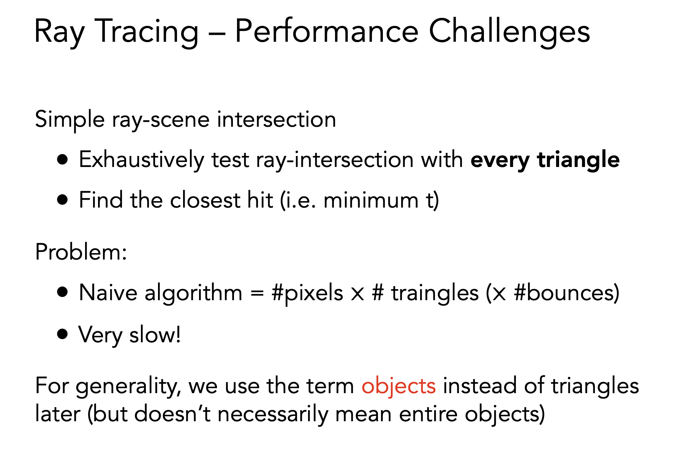
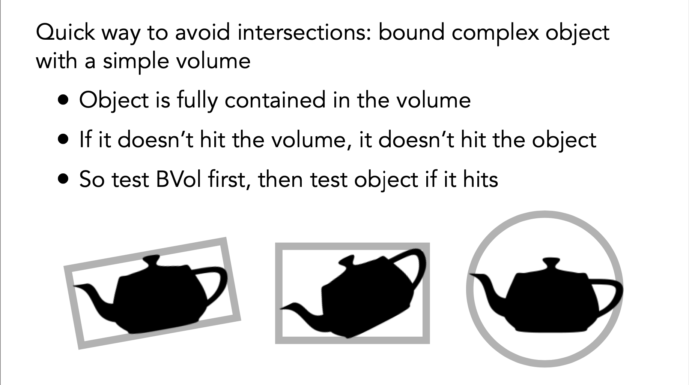
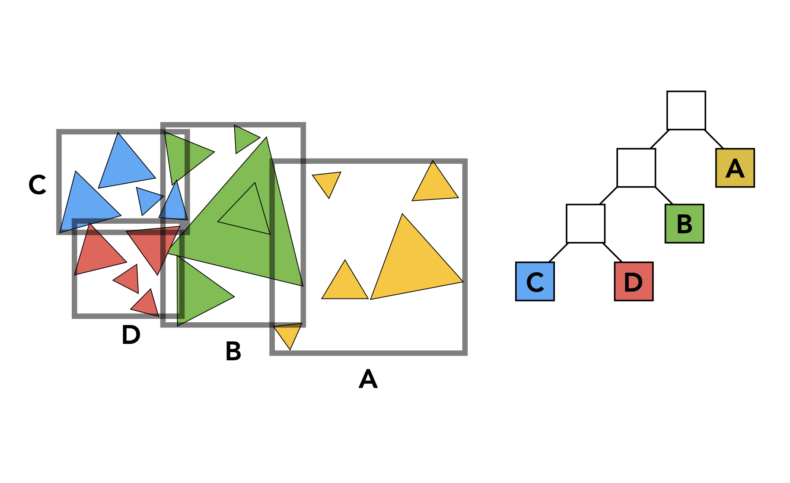
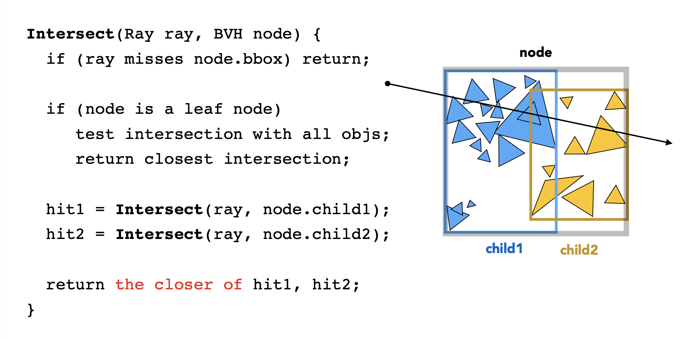
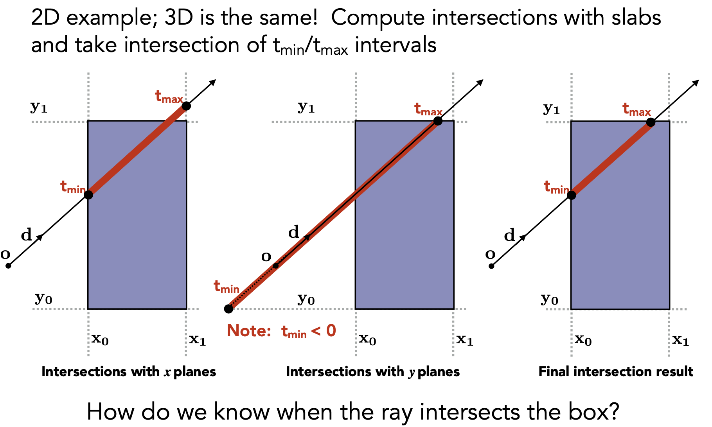
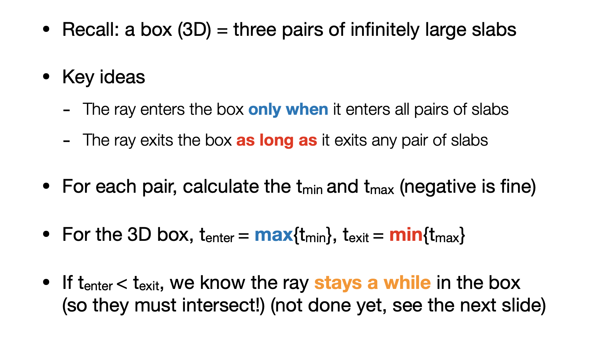

# Assignment6

## Compile and Run it
**Compile**<br>
```unix
mkdir Code/build; cd Code/build
cmake ..
make
```
**Run**<br>
```
./Raytracing
```


<br>

## Techniques
### Bounding Volumes




<br>

### Bounding Volume Hierarchy (BVH)

* **Find bounding box**

```cpp
// Triangle.hpp func getBounds()
    Bounds3 getBounds() { return bounding_box; }

// Triangle.hpp func MeshTriangle()
    // return the bound of triangles
    bounding_box = Bounds3(min_vert, max_vert);


    auto mesh = loader.LoadedMeshes[0];

    Vector3f min_vert = Vector3f{std::numeric_limits<float>::infinity(),
                                 std::numeric_limits<float>::infinity(),
                                 std::numeric_limits<float>::infinity()};
    Vector3f max_vert = Vector3f{-std::numeric_limits<float>::infinity(),
                                 -std::numeric_limits<float>::infinity(),
                                 -std::numeric_limits<float>::infinity()};
    for (int i = 0; i < mesh.Vertices.size(); i += 3) {
        std::array<Vector3f, 3> face_vertices;
        for (int j = 0; j < 3; j++) {
            auto vert = Vector3f(mesh.Vertices[i + j].Position.X,
                                 mesh.Vertices[i + j].Position.Y,
                                 mesh.Vertices[i + j].Position.Z) *
                        60.f;
            face_vertices[j] = vert;

            min_vert = Vector3f(std::min(min_vert.x, vert.x),
                                std::min(min_vert.y, vert.y),
                                std::min(min_vert.z, vert.z));
            max_vert = Vector3f(std::max(max_vert.x, vert.x),
                                std::max(max_vert.y, vert.y),
                                std::max(max_vert.z, vert.z));
        }


// Bound3.hpp func Union()
inline Bounds3 Union(const Bounds3& b1, const Bounds3& b2)
{
    // return the bound of two bounds
    Bounds3 ret;
    ret.pMin = Vector3f::Min(b1.pMin, b2.pMin);
    ret.pMax = Vector3f::Max(b1.pMax, b2.pMax);
    return ret;
}
```

* **Recursively split set of objects in two subsets**

```cpp
// main.cpp func main()
    scene.buildBVH();

// scene.cpp func buildBVH()
    this->bvh = new BVHAccel(objects, 1, BVHAccel::SplitMethod::NAIVE);

// BVH.cpp func BVHAccel()
    root = recursiveBuild(primitives);

```

* **Heuristic: Split node at location of median object**
* **Recompute the bounding box of the subsets**
> **Heuristic: Stop when node contains few elements (e.g. 5)**

```cpp
// BVH.hpp struct BVHBuildNode
struct BVHBuildNode {
    Bounds3 bounds;
    BVHBuildNode *left;
    BVHBuildNode *right;
    Object* object;

public:
    int splitAxis=0, firstPrimOffset=0, nPrimitives=0;
    // BVHBuildNode Public Methods
    BVHBuildNode(){
        bounds = Bounds3();
        left = nullptr;right = nullptr;
        object = nullptr;
    }
};

```

* **Only the leaf store objects**

```cpp
// BVH.cpp func recursiveBuild()
BVHBuildNode* BVHAccel::recursiveBuild(std::vector<Object*> objects)
{
    BVHBuildNode* node = new BVHBuildNode();

    // Compute bounds of all primitives in BVH node
    Bounds3 bounds;
    
    for (int i = 0; i < objects.size(); ++i)
        bounds = Union(bounds, objects[i]->getBounds());
    // objects.size(): 4968
    if (objects.size() == 1) {
        // only the leaf store object
        // Create leaf _BVHBuildNode_
        node->bounds = objects[0]->getBounds();
        node->object = objects[0];
        node->left = nullptr;
        node->right = nullptr;
        return node;
    }
    else if (objects.size() == 2) {
        node->left = recursiveBuild(std::vector{objects[0]});
        node->right = recursiveBuild(std::vector{objects[1]});

        node->bounds = Union(node->left->bounds, node->right->bounds);
        return node;
    }
    // our case
    else {
        Bounds3 centroidBounds;
        for (int i = 0; i < objects.size(); ++i)
            centroidBounds =
                Union(centroidBounds, objects[i]->getBounds().Centroid());
        int dim = centroidBounds.maxExtent();
        switch (dim) {
        case 0:
            std::sort(objects.begin(), objects.end(), [](auto f1, auto f2) {
                return f1->getBounds().Centroid().x <
                       f2->getBounds().Centroid().x;
            });
            break;
        case 1:
            std::sort(objects.begin(), objects.end(), [](auto f1, auto f2) {
                return f1->getBounds().Centroid().y <
                       f2->getBounds().Centroid().y;
            });
            break;
        case 2:
            std::sort(objects.begin(), objects.end(), [](auto f1, auto f2) {
                return f1->getBounds().Centroid().z <
                       f2->getBounds().Centroid().z;
            });
            break;
        }

        auto beginning = objects.begin();
        // median object
        auto middling = objects.begin() + (objects.size() / 2);
        auto ending = objects.end();

        auto leftshapes = std::vector<Object*>(beginning, middling);
        auto rightshapes = std::vector<Object*>(middling, ending);

        assert(objects.size() == (leftshapes.size() + rightshapes.size()));

        node->left = recursiveBuild(leftshapes);
        node->right = recursiveBuild(rightshapes);

        node->bounds = Union(node->left->bounds, node->right->bounds);
    }

    return node;
}

```

<br>

* **Then get intersection with all leaf objects**

`Render() -> CastRay()` **Please check** **[Assignment5 Find the primary ray](https://github.com/Angold-4/Angold4-GAMES101/tree/main/Assignment/Assignment5#1-find-the-primary-ray)**

```cpp
// scene.cpp func castRay()
    Intersection intersection = Scene::intersect(ray);

// scenc.cpp func intersect()
Intersection Scene::intersect(const Ray &ray) const
{
    // the type of bvh is BVHBuildNode
    return this->bvh->Intersect(ray);
}

// BVH.cpp func Intersect()
Intersection BVHAccel::Intersect(const Ray& ray) const
{
    Intersection isect;
    if (!root)
        return isect;
    isect = BVHAccel::getIntersection(root, ray);
    return isect;
}
```

```cpp
// Intersection.hpp struct Intersection
struct Intersection
{
    Intersection(){
        happened=false;
        coords=Vector3f();
        normal=Vector3f();
        distance= std::numeric_limits<double>::max();
        obj =nullptr;
        m=nullptr;
    }
    bool happened;
    Vector3f coords;
    Vector3f normal;
    double distance;
    Object* obj;
    Material* m;
};

```

<br>



```cpp
// BVH.cpp func getIntersection()
Intersection BVHAccel::getIntersection(BVHBuildNode* node, const Ray& ray) const
{
    // Traverse the BVH to find intersection

    Intersection isect;

    std::array<int, 3> dirIsNeg;
    dirIsNeg[0] = int(ray.direction.x >= 0);
    dirIsNeg[1] = int(ray.direction.y >= 0);
    dirIsNeg[2] = int(ray.direction.z >= 0);

    // ray misses node bounding box
    if (!node->bounds.IntersectP(ray, ray.direction_inv, dirIsNeg)) return isect;

    // leaf node
    if (node->left == nullptr && node->right == nullptr) {
        // then getIntersection
        isect = node->object->getIntersection(ray);
        return isect;
    }

    auto hit1 = getIntersection(node->left, ray);
    auto hit2 = getIntersection(node->right, ray);

    return hit1.distance < hit2.distance ? hit1 : hit2;

}


```

<br>

### Ray Intersection with Axis-Aligned Box




```
// Bounds3.hpp func IntersectP()
inline bool Bounds3::IntersectP(const Ray& ray, const Vector3f& invDir,
                                const std::array<int, 3>& dirIsNeg) const
{
    // invDir: ray direction(x,y,z), invDir=(1.0/x,1.0/y,1.0/z), use this because Multiply is faster that Division
    // dirIsNeg: ray direction(x,y,z), dirIsNeg=[int(x>0),int(y>0),int(z>0)], use this to simplify your logic
    // test if ray bound intersects
    
    const auto& origin = ray.origin;
    float tEnter = -std::numeric_limits<float>::infinity();
    float tExit = std::numeric_limits<float>::infinity();
    for (int i = 0; i < 3; i++)
    {
        float min = (pMin[i] - origin[i]) * invDir[i];
        float max = (pMax[i] - origin[i]) * invDir[i];
        if (!dirIsNeg[i]) {
            std::swap(min, max);
        }

        tEnter = std::max(min, tEnter);
        tExit = std::min(max, tExit);
    }
    return tEnter < tExit && tExit >= 0;
}

```
