# Assignment7

## Compile and Run it
**Compile**<br>
```unix
mkdir Code/build; cd Code/build
cmake ..
make
```
**Run**<br>
```
./Raytracing
```
**Path traced: direct illumination**<br>
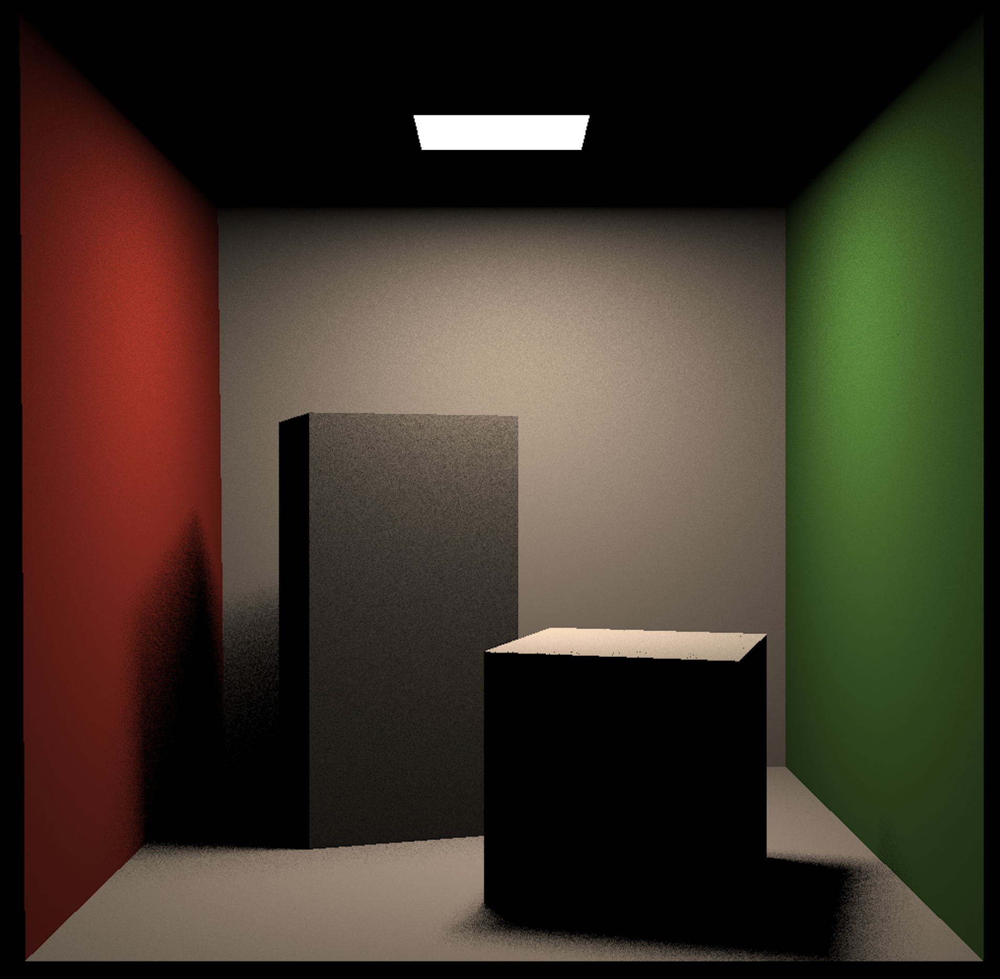
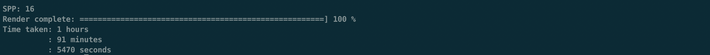
<br>

**Path traced: global illumination**<br>

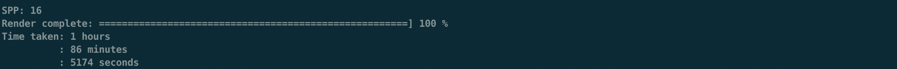

<br>

## Techniques
### Path Tracing
**Pseudo-code:**<br>

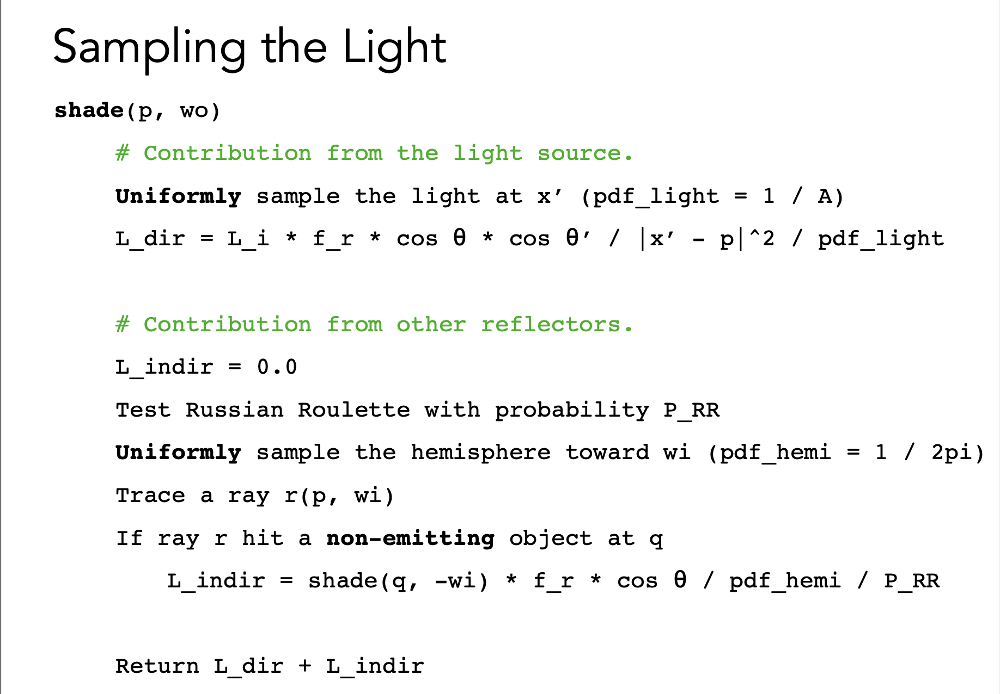
```cpp
// Scene.cpp func castRay()

// Implementation of Path Tracing
Vector3f Scene::castRay(const Ray &ray, int depth) const
{
    // TODO Implement Path Tracing Algorithm here
    Intersection intersection = intersect(ray);
    Vector3f hitcolor = Vector3f(0);

    if(intersection.emit.norm() > 0) hitcolor = Vector3f(1);

    else if(intersection.happened)
    {
        Vector3f wo = normalize(-ray.direction);
        Vector3f p = intersection.coords;
        Vector3f N = normalize(intersection.normal);

        float pdf_light = 0.0f;
        Intersection inter;

        sampleLight(inter, pdf_light); // define the pdf_light and inter_coords(on light)
        Vector3f x = inter.coords;
        Vector3f ws = normalize(x-p);
        Vector3f NN = normalize(inter.normal);

        Vector3f L_dir = Vector3f(0);

        // Contribution from the light source
        if((intersect(Ray(p, ws)).coords - x).norm() < 0.01) // if the is not blocked in the middle
        {
            L_dir = inter.emit * intersection.m->eval(wo, ws, N) * dotProduct(ws, N) * dotProduct(-ws, NN) /
                (((x-p).norm() * (x-p).norm()) * pdf_light);
        }

        // Contribution from other reflectors
        Vector3f L_indir = Vector3f(0);
        float P_RR = get_random_float(); // Russian Roulette == 0.8
        if(P_RR < Scene::RussianRoulette)
        {
            Vector3f wi = intersection.m->sample(wo, N);
            // sample() in Material.hpp: return the reflect light direction
            // with incident light direction and normalized vector in specific material
            L_indir = castRay(Ray(p, wi), depth) * intersection.m->eval(wi, wo, N) * dotProduct(wi, N) /
                (intersection.m->pdf(wi, wo, N) * Scene::RussianRoulette);
        }
        hitcolor = L_dir + L_indir;
    }
    return hitcolor;
}
```
### Essentials in Path Tracing (1. Intensity, Irradiance and Radiance)
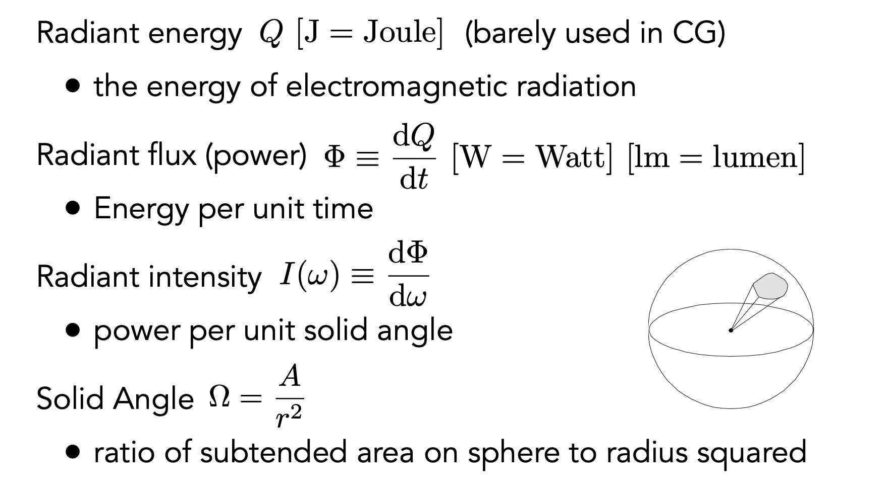
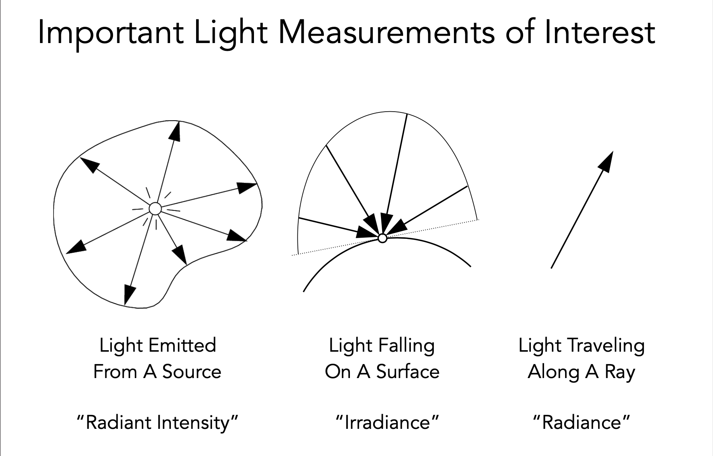
#### Intensity
* **Definition: The radiant (luminous) intensity is the power per unit solid angle emitted by a point light source.**<br>

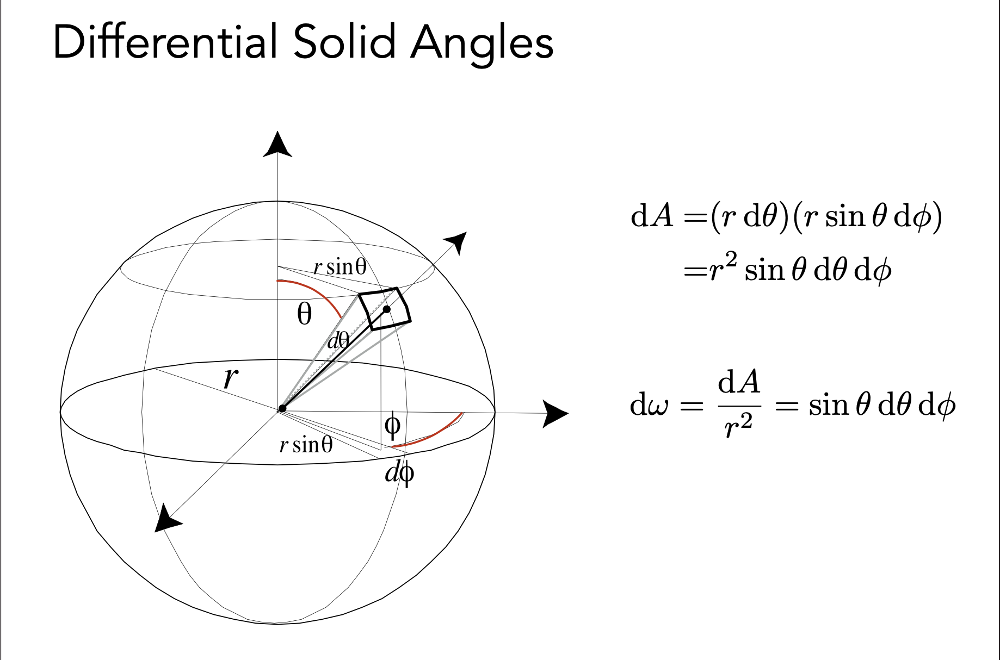
* **Ex. Modern LED Light**<br>
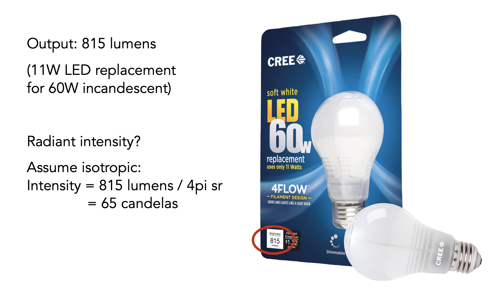

#### Irradiance
* **Definition: The irradiance is the power per unit area incident on a surface point.**<br>

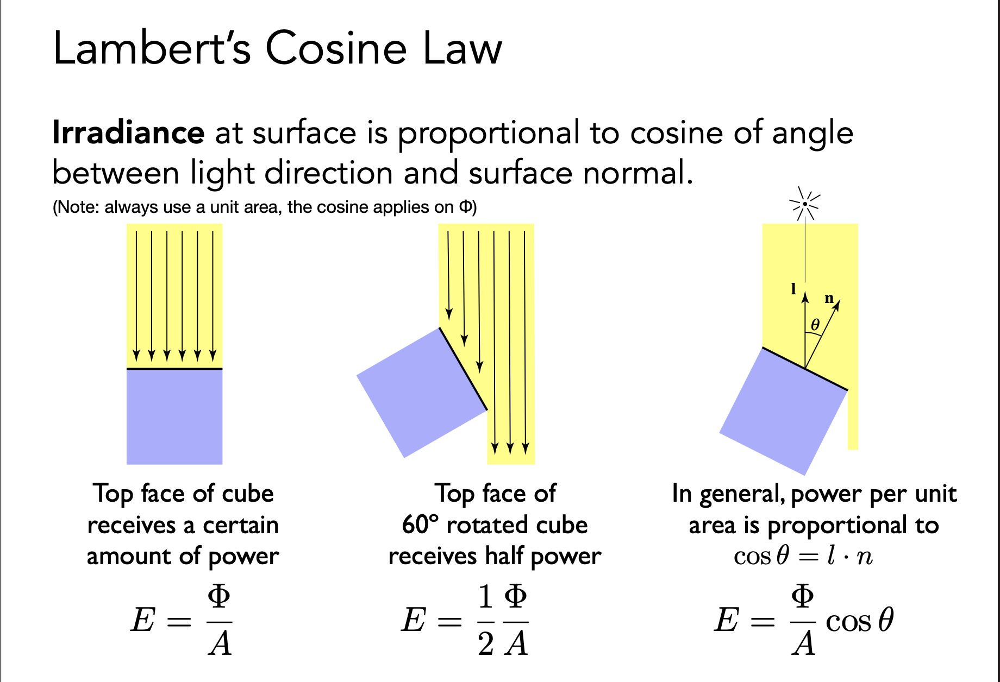
* **Ex. Falloff of Irradiance (Intensity remains the same)**<br>
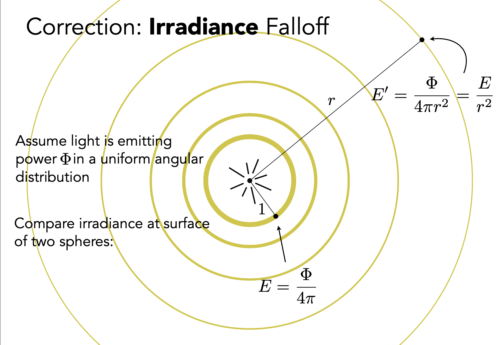

#### Radiance
**Definition: The radiance (luminance) is the power emitted, reflected, transmitted or received by a surface, per unit solid angle, per projected unit area.**<br>

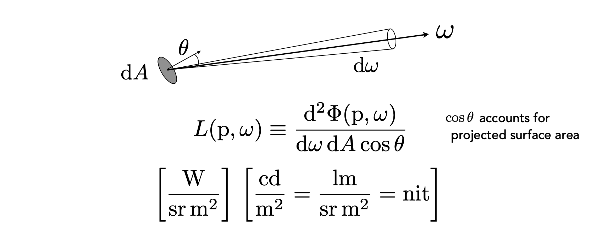

**Recall**
* **Irradiance: Power per projected unit area**
* **Intensity: Power per solid angle**
<br>

* **Radiance: Irradiance per solid angle**
* **Radiance: Intensity per projected unit area**
<br>

* **Ex. Irradiance vs. Radiance**
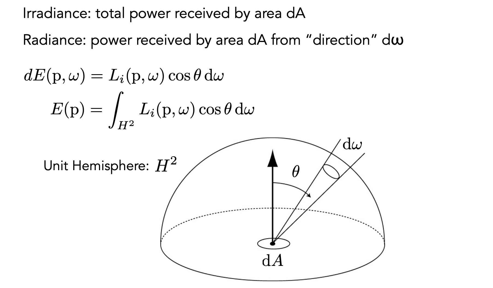


### Essentials in Path Tracing (2. Birectional Reflectance Distribution Function)
#### What is Reflection?
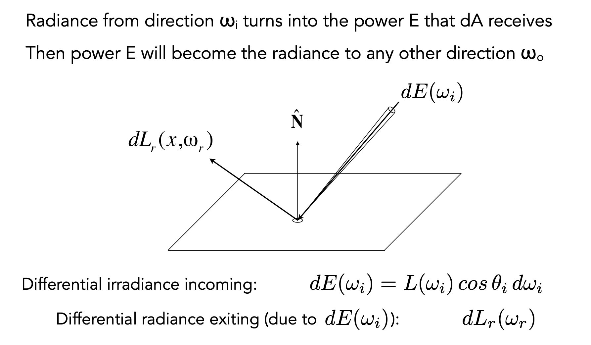
#### BRDF


### Essentials in Path Tracing (3. The Reflection Equation)
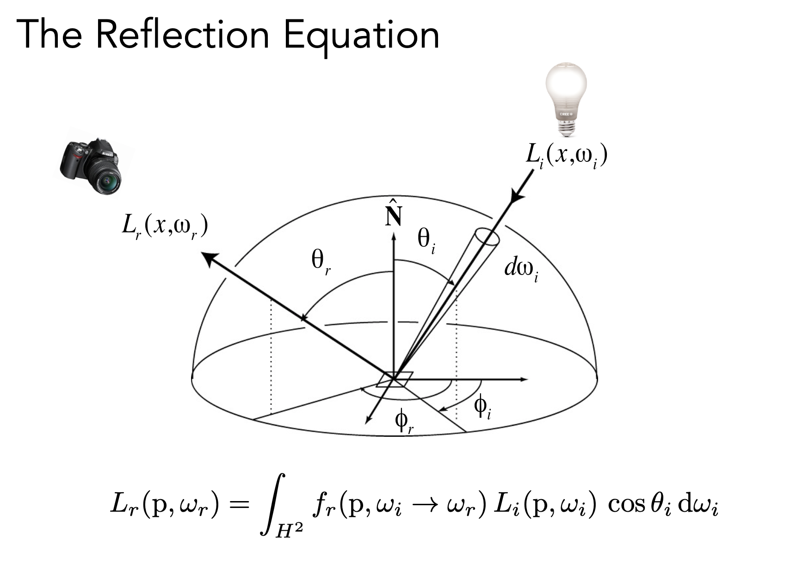


### Essentials in Path Tracing (4. The Rendering Equation)
**Whitted-Style Ray Tracing is Wrong**
* **Always perform specular reflection / refractions**
* **Stop bouncing at diffuse surfaces**

**Rendering Equation -- We conclude it from Radiometry**<br>
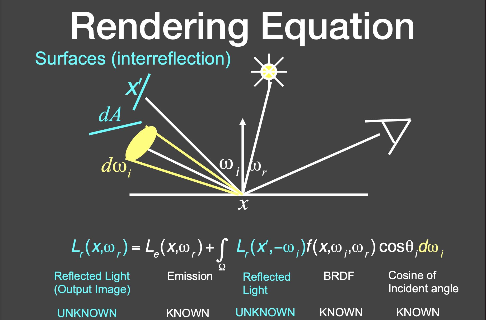
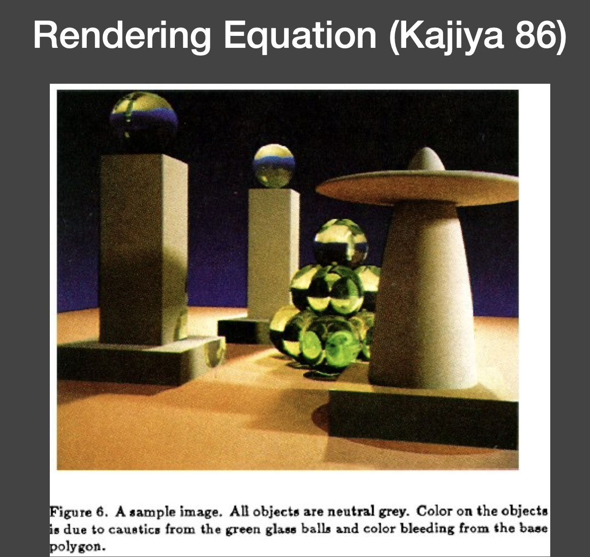
